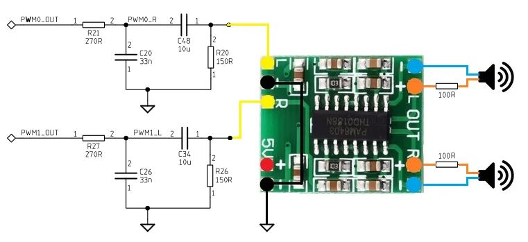

# piSaber
## A Raspberry Pi controlled lightsaber using neopixels

[](https://www.youtube.com/shorts/3u1CNfoO4zo)

# Resources
https://fredrik.hubbe.net/lightsaber/v4/<BR>
https://www.thecustomsabershop.com/Pixel-Blades-C153.aspx<BR>
https://www.thecustomsabershop.com/1-Thick-walled-Trans-White-PolyC-40-long-P528.aspx<BR>
https://www.instructables.com/Arduino-Based-Lightsaber-With-Light-and-Sound-Effe/<BR>
    https://github.com/AlexGyver/EnglishProjects/tree/master/GyverSaber<BR>
<BR>
https://www.instructables.com/PAM8403-6W-STEREO-AMPLIFIER-TUTORIAL/<BR>
https://othermod.com/raspberry-pi-zero-audio-circuit/<BR>
PM8403/raspi demo https://www.youtube.com/watch?v=6YBBcBQpCiA<BR>
https://learn.adafruit.com/adding-basic-audio-ouput-to-raspberry-pi-zero/pi-zero-pwm-audio<BR>
https://docs.circuitpython.org/en/latest/shared-bindings/audiopwmio/index.html<BR>

# hardware
machine screws #10-32 x 3.8"<BR>
5/64 drill bit (connecting port to hat board)<BR>
3/32 drill bit (pizero board hole size)<BR>
pizero<BR>
1000uF capacitor<BR>
220Ohm, 330Ohm, resistor<BR>
MPU6050<BR>
SN74AHCT125N<BR>
pushbutton<BR>
USB connector<BR>
neopixel strip<BR>
5pin connectors<BR>
gorilla superglue<BR>
duct tape<BR>
Hillan Plastic Hole Plugs<BR>
https://www.lowes.ca/product/hole-plugs/hillman-plastic-hole-plugs-2-pack-139486<BR>
12" X 1.5" Plastic Slip Joint extension tube<BR>
https://www.lowes.ca/product/under-sink-plumbing/plumb-pak-1-12-in-plastic-slip-joint-extension-tube-15698<BR>
1.5" Brass SLip Joint Nut<BR>
https://www.lowes.ca/product/under-sink-plumbing/1-12-in-dia-brass-slip-joint-nut-191399<BR>
Xirtic PVC 1" x 1.5" Nipple<BR>
https://www.lowes.ca/product/pvc-fittings/xirtec-pvc-1-inx1-12-in-pvc-sch-80-nipple-mpt-2887385<BR>
EnergyQC 5000mAh cylindrincal power supply<BR>
https://www.amazon.ca/dp/B0B11R3QHY?ref=ppx_yo2ov_dt_b_product_details&th=1<BR>
PAM8403<BR>
https://www.amazon.ca/dp/B00LODGV64?psc=1&ref=ppx_yo2ov_dt_b_product_details<BR>
1.5" 4 ohm 3W speakers<BR>
https://www.amazon.ca/dp/B01LYHFS1P?psc=1&ref=ppx_yo2ov_dt_b_product_details<BR>


### Neopixels
Since neopixels are 5V and raspi GPIO is 3.3V we need a 3.3V->5V signal converter (SN74AHCT125N)<BR>
Connect a 1000uF capacitor across 5V/GND to limit any spike in current draw by the neopixels.<BR>
A 330ohm resistor on the signal line to the neopixels.<BR>
NOTE: if you're powering the raspi and neopixels separately, be sure to connect the grounds together, otherwise the signal line gets corrupted.<BR>

### Motion sensor (MPU6050)
https://learn.adafruit.com/mpu6050-6-dof-accelerometer-and-gyro/pinouts<BR>

### Sound + Power Amplifier
Can create a headphone jack using PWM by using DT overlays and editing /boot/config.txt
```
dtoverlay=pwm-2chan,pin=18,func=2,pin2=13,func2=4
dtoverlay=audremap,enable_jack=on
```

then you can list the device 
```
aplay -l
```
turn down audio using alsamixer
then play a file 
```
aplay ~/piSaber/sounds/SK1.wav
```
We only have one speaker so just need to PWM pin and then connected through one channel of the amplier.<BR>
If using PWM as audio, it can't be used for anything else (along with some other pins too like GPIO18)<BR>
Very terrible sound if directly connected to PWM.<BR>
So we have to put a filter in front of the amp.<BR>
<BR>

```
sudo pip3 install pygame
sudo pip3 install pyalsaaudio
sudo apt-get install libsdl2-mixer-2.0-0
```

# sourcing blade
https://plasticworld.ca/product/acrylic-round-tube/ - $11 CAD clear acrylic - 6ft
https://www.thecustomsabershop.com/1-Thick-walled-Trans-White-PolyC-40-long-P528.aspx - $12 USD polyc (plus $40 shipping) 40"
https://www.professionalplastics.com/PolycarbTube - $97 USD 8ft polyC clear
http://k-mac-plastics.com/polycarbonate-tubes.htm - $4.45USD/ft polyC clear ($40 shipping)
https://www.homedepot.ca/product/metalux-residential-4ft-t8-bulb-tube-guard-with-end-caps/1001654143?rrec=true $8 CAD 4ft polyC clear

### going with PEX. very cheap and works really well
https://www.homedepot.ca/product/sharkbite-1-inch-x-10-feet-white-pex-pipe/1001013735

# install (from buster)
```
sudo apt-get update
sudo apt-get upgrade
sudo apt-get install python3-pip

sudo ln -fs /usr/bin/python3 /usr/bin/python

sudo apt-get install git
https://github.com/settings/tokens
git config --global user.name ""
git config --global user.email ""
<commit a change and push it, fill in email/token>
git config --global credential.helper cache
    
sudo apt-get install samba samba-common-bin
sudo vi /etc/samba/smb.conf
[pi]
path = /home/pi/
writeable=Yes
create mask=0777
directory mask=0777
public=no
mangled names = no
sudo smbpasswd -a pi
sudo systemctl restart smbd

```

# install (for neopixels)
We'll be running neopixels using sudo - so must install module using sudo<BR>
https://learn.adafruit.com/neopixels-on-raspberry-pi/python-usage<BR>
```
sudo pip3 install rpi_ws281x adafruit-circuitpython-neopixel
sudo python3 -m pip install --force-reinstall adafruit-blinka
```
NeoPixels must be connected to GPIO10, GPIO12, GPIO18 or GPIO21 to work! GPIO18 is the standard pin.
Sound must be disabled to use GPIO18. We're using GPIO12 for sound - so that leaves us GPIO10/21


# install (for mpu6050)
https://www.electronicwings.com/raspberry-pi/raspberry-pi-i2c<BR>
Have to configure I2C on raspi using raspi-config<BR>
sudo pip3 install asyncio<BR>
sudo pip3 install smbus<BR>

# install (for audio / power amplifier)


# START AS SERVICE
```
sudo vi /etc/systemd/system/pisaber.service
[Unit]
Description=pisaber
After=network-online.target
[Service]
ExecStart=/home/pi/piSaber/app.py
[Install]
WantedBy=multi-user.target

add shebang to app.py (#!/usr/bin/python3)
chmod +x ~/piSaber/app.py

sudo systemctl daemon-reload
sudo systemctl enable pisaber
sudo systemctl restart pisaber
sudo systemctl status pisaber.service

sudo systemctl disable pisaber
```
[](https://www.youtube.com/shorts/WJEqB1KE0rI)
[](https://www.youtube.com/shorts/bdTgkJ8iOiE)


